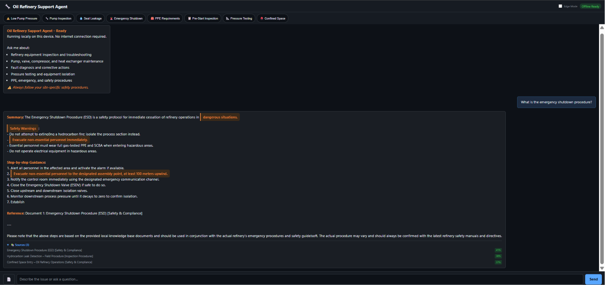
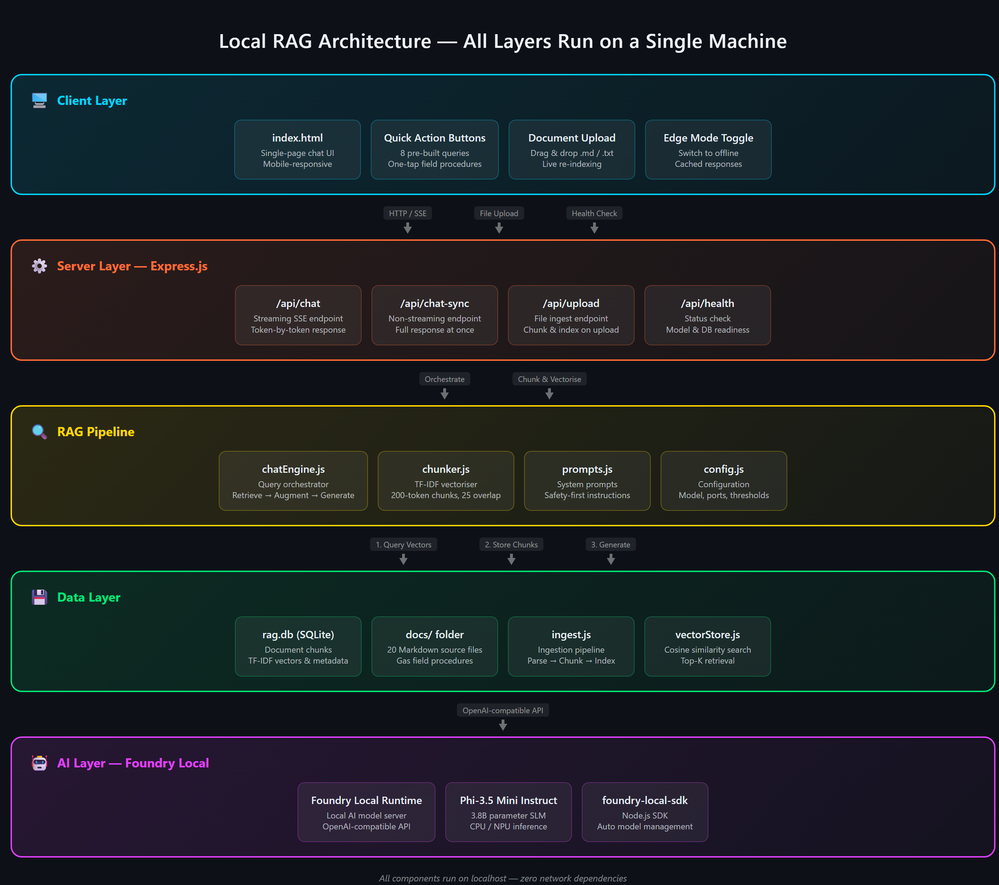

# Offline Oil Refinery Technical Support Agent

An offline AI-powered technical support assistant that combines Microsoft Foundry Local and Retrieval-Augmented Generation (RAG) to deliver reliable, domain-specific answers for oil refinery operations using local documentation.


> **Developed as part of the Microsoft AI Innovators Summer Internship Program.**
>
> This project is based on Microsoft's Foundry Local RAG reference implementation and has been adapted into an offline technical support assistant for oil refinery operations by customizing the knowledge base, prompts, user interface, and domain-specific content.

<p align="center">
  
</p>

## Project Overview

Large Language Models (LLMs) are powerful, but they may generate inaccurate or generic responses when answering questions about private, domain-specific, or operational documents.

This project addresses that challenge by transforming Microsoft's Foundry Local RAG reference implementation into an offline technical support assistant tailored for oil refinery operations.

Instead of relying solely on the model's internal knowledge, the assistant retrieves the most relevant information from a local knowledge base before generating a response. This approach improves reliability, reduces hallucinations, keeps sensitive operational data on-device, and provides source-grounded answers for inspection, maintenance, troubleshooting, and safety procedures.

> **Key Idea**
>
> Keep the documents local, retrieve only the most relevant information, and generate reliable answers without sending sensitive data to the cloud.

## Features

- Fully offline AI assistant with no cloud dependency
- Retrieval-Augmented Generation (RAG) for reliable, context-aware responses
- Source-grounded answers based on retrieved local documents
- Semantic document retrieval using vector search
- Markdown-based knowledge base that can be updated without retraining the model
- Domain-specific technical support for oil refinery inspection, maintenance, troubleshooting, and safety procedures
- Clean and responsive web interface with real-time streaming responses

## Architecture

The application follows a Retrieval-Augmented Generation (RAG) pipeline. User questions are matched against a local knowledge base using semantic search. The most relevant document chunks are then provided to the local language model, enabling accurate, context-aware responses without relying on cloud services.

<p align="center">
  
</p>

## Technology Stack

| Technology | Purpose |
|------------|---------|
| Microsoft Foundry Local | Runs the local AI model and provides the inference runtime |
| Phi-3.5 Mini | Generates context-aware responses |
| Retrieval-Augmented Generation (RAG) | Retrieves relevant context before response generation |
| TF-IDF Vectorization | Converts documents into searchable vector representations |
| SQLite | Stores document chunks, vectors, and metadata |
| JavaScript (Node.js) | Backend and frontend application logic |
| Express.js | REST API and streaming chat endpoints |
| Markdown | Stores and manages the local knowledge base |

## Installation

### Prerequisites

Before running the project, make sure the following are installed:

- Node.js 20 or later
- Microsoft Foundry Local
- Phi-3.5 Mini model

For installation instructions, refer to the official Microsoft Foundry Local documentation.

### Clone the repository

```bash
git clone https://github.com/yigitalin/oil-refinery-local-rag.git
cd oil-refinery-local-rag
```

### Install dependencies

```bash
npm install
```

### Build the local knowledge base

```bash
npm run ingest
```

### Start the application

```bash
npm start
```

The application will be available at:

```text
http://127.0.0.1:3000
```

> **Note**
>
> Before running the application, make sure Microsoft Foundry Local is installed and the Phi-3.5 Mini model is available on your system.

## Project Structure

```text
oil-refinery-local-rag/
│
├── data/                  # SQLite database and indexed knowledge base
├── docs/                  # Markdown source documents
├── public/                # Frontend assets
├── screenshots/           # Images used in the README
├── src/
│   ├── chunker.js
│   ├── chatEngine.js
│   ├── config.js
│   ├── ingest.js
│   ├── prompts.js
│   ├── server.js
│   └── vectorStore.js
│
├── package.json
└── README.md
```

## Example Queries

The following example questions demonstrate the types of queries the assistant can answer:

- What is the emergency shutdown procedure?
- What PPE is required for oil refinery maintenance work?
- How should a centrifugal pump be inspected?
- What are the safety precautions before maintenance?
- How do I troubleshoot a heat exchanger?
- What should I do if there is a hydrocarbon leak?

## Future Improvements

- Support additional document formats (PDF, DOCX)
- Replace TF-IDF with embedding-based semantic retrieval
- Introduce hybrid search for improved retrieval quality
- Add conversation history and memory
- Expand the knowledge base with additional refinery documentation
- Improve the user interface and user experience

## Acknowledgements

This project was developed as part of the Microsoft AI Innovators Summer Internship Program.

Special thanks to Microsoft for providing the Foundry Local platform and the original RAG reference implementation that served as the foundation for this project.

## License

This project is licensed under the MIT License. See the `LICENSE` file for more information.